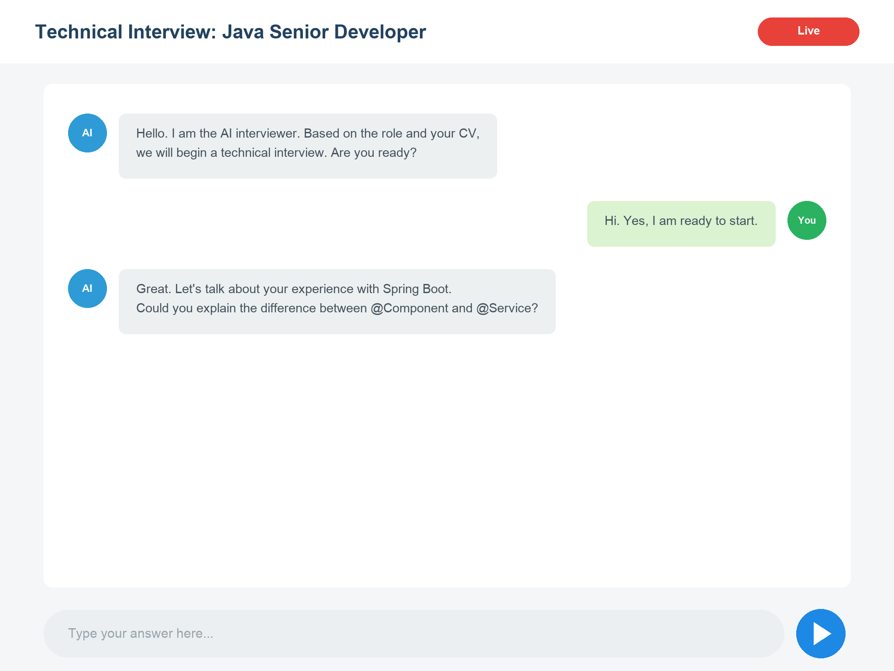
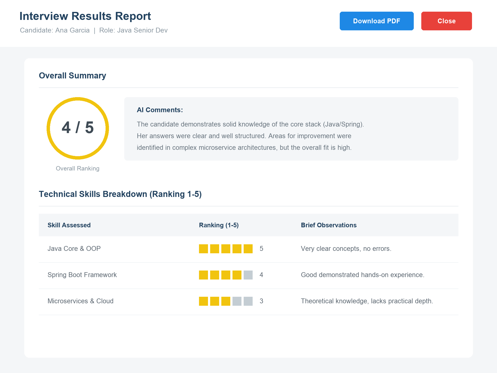
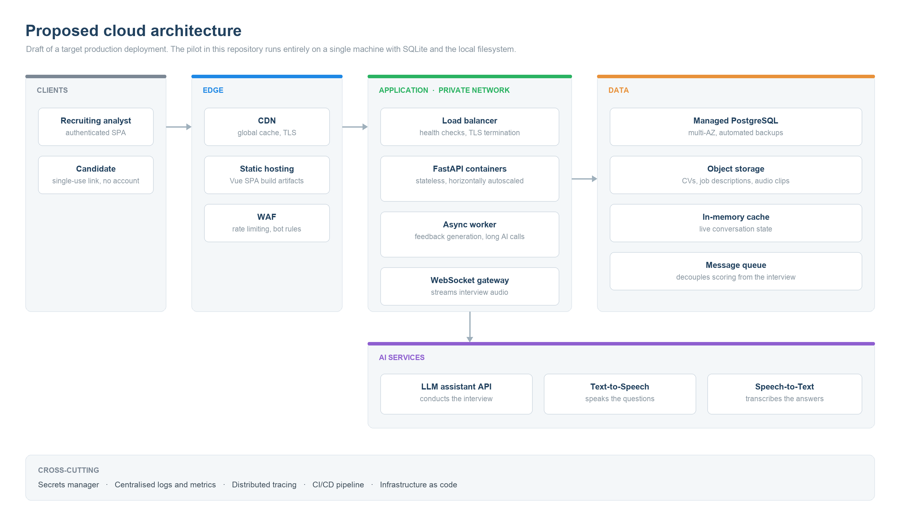

# AI Technical Interview System

An AI agent that conducts technical screening interviews, reads the candidate's CV against the job description, holds a real conversation, and returns a structured 1–5 skill assessment.

> **🏆 First place — Globant internal hackathon, 2025.**
> Built end to end in four days (Nov 29 – Dec 2, 2025) using a specification-driven AI workflow. The commit history reflects that timeline.

---

## What it does

Initial technical screenings are expensive, inconsistent, and don't scale: every interviewer asks different questions and grades on a different curve. This system replaces that first pass with an AI interviewer that works from two inputs — the candidate's CV and the job description — and produces a comparable, evidence-backed evaluation for every candidate.

A recruiting analyst creates the interview, uploads the CV and JD, and shares a single-use link. The candidate opens the link and talks to the AI interviewer directly in the browser, with no account and no system navigation. When the conversation ends, the analyst gets the full transcript plus a structured ranking per technical skill.

The scoring deliberately covers only quantifiable technical competencies. Cultural fit and soft skills stay with the human interviewer in later rounds.

## Screenshots

<!-- TODO: replace the design references below with real screenshots of the running app.
     Suggested captures: interview execution (candidate chat + timer), interview detail
     with generated feedback, and the interviews listing. -->

**Candidate interview interface**



**Analyst view of interview results**



**Listings and management**


> These are the design references the implementation was built against. Screenshots of the running application are pending.

## Technical highlights

**Specification-driven development.** The project was not prompted into existence file by file. Before any code, the system was specified in a `memory-bank/` (data model, system patterns, chat logic, requirements, UI reference) and a set of `.clinerules/` that constrain layering, naming, and data access conventions. Those specs drove the implementation and are committed in the repository — the interesting artifact here is as much the method as the result.

**Strict layered backend.** Routes never touch the database. Every request goes API → Service → Repository → Database, with Pydantic schemas at the boundary and SQLAlchemy models underneath. The separation held up through four days of rapid change, which is the actual test of it.

**Single-use candidate links.** Candidates never get an account. Access is granted through a generated interview link that resolves to one interview and exposes only the chat and transcript endpoints for it, so the candidate-facing surface is a strict subset of the API.

**Conversation state and assessment.** The AI receives the CV, the JD, and the role and seniority context at kickoff, then conducts a multi-turn interview with the full transcript persisted turn by turn. On completion it produces structured feedback with a 1–5 ranking per skill, stored alongside the transcript rather than regenerated on read.

**Graceful degradation on AI latency.** The assistant endpoint can take tens of seconds. Timeouts, typing indicators, and retry handling were built in because a hung chat is the one failure a live interview cannot absorb.

## Features

- **AI-conducted interviews** driven by the candidate's CV and the job description
- **Structured feedback** with a 1–5 ranking per technical skill, plus the full transcript
- **Role-based access** for administrators, recruiting analysts, and candidates
- **Single-use interview links** for candidate access without accounts
- **CV and JD upload/download** (`.txt` and `.md`, 10 MB cap, validated server-side)
- **Timed interview execution** with a live chat interface
- **Full CRUD** for users, candidates, and interviews, plus lookup table management
- **Dashboard and analytics** views over interview activity
- **JWT authentication** with bcrypt password hashing

## Architecture

```
Backend                          Frontend
─────────────────────────        ─────────────────────────
API Layer (FastAPI routes)       Views (pages)
        ↓                                ↓
Service Layer (business logic)   Components (reusable UI)
        ↓                                ↓
Repository Layer (data access)   Store (Pinia)
        ↓                                ↓
Database (SQLite)                Services / API (Axios)
```

**Backend:** FastAPI · SQLAlchemy 2.0 · Pydantic v2 · SQLite · JWT (python-jose) · bcrypt (passlib) · httpx · aiofiles · pytest

**Frontend:** Vue 3 (Composition API) · Vite · Vue Router 4 · Pinia · Tailwind CSS · Axios

**AI:** OpenAI-compatible assistant endpoint. The pilot ran against Globant Enterprise AI with a specialized interviewer model.

### Data model

Core entities are users, candidates, interviews, interview transcripts, and interview feedback, with lookup tables for roles, seniorities, clients, and statuses. Users create interviews; candidates participate in them; each interview carries one transcript and one feedback record. The full DDL lives in `backend/db/schema.sql`.

## Quick start

**Prerequisites:** Python 3.10, Node.js 18+, SQLite 3.x

### Backend

```bash
cd backend
python -m venv venv && source venv/bin/activate   # Windows: venv\Scripts\activate
pip install -r requirements.txt
```

Create `backend/.env`:

```bash
DATABASE_URL=sqlite:///./interview_system.db

SECRET_KEY=change-me
ALGORITHM=HS256
ACCESS_TOKEN_EXPIRE_MINUTES=30

# Any OpenAI-compatible assistant endpoint
AI_API_URL=https://api.openai.com/v1
AI_API_KEY=your-key-here

MAX_UPLOAD_SIZE=10485760
ALLOWED_EXTENSIONS=txt,md
```

Initialize the database and run:

```bash
python -m app.db.init_db        # or: sqlite3 ../interview_system.db < db/schema.sql
uvicorn app.main:app --reload --port 8000
```

### Frontend

```bash
cd frontend
npm install
echo "VITE_API_BASE_URL=http://localhost:8000/api/v1" > .env
npm run dev
```

Frontend at `http://localhost:3000`, API at `http://localhost:8000`, interactive API docs at `http://localhost:8000/docs`.

### Tests

```bash
cd backend && pytest        # service and API tests
cd frontend && npm run lint
```

## Project structure

```
.
├── backend/
│   ├── app/
│   │   ├── api/v1/routes/   # auth, users, candidates, interviews, lookup, dashboard
│   │   ├── services/        # business logic, incl. ai_agent_service
│   │   ├── repositories/    # data access
│   │   ├── models/          # SQLAlchemy models
│   │   ├── schemas/         # Pydantic schemas
│   │   ├── core/            # config, security, logging
│   │   ├── utils/           # file handling, interview link generation
│   │   ├── db/              # session, initialization
│   │   └── tests/
│   └── db/schema.sql        # full DDL and seed data
├── frontend/
│   └── src/
│       ├── views/           # interviews, execution, candidates, users, analytics, settings
│       ├── components/      # common, forms, layout, lists
│       ├── store/           # Pinia stores
│       └── utils/           # API client, validation
├── memory-bank/             # system specifications that drove development
├── .clinerules/             # architectural constraints for AI-assisted development
└── docs/                    # project definition, user stories, mockups, sample CVs/JDs
```

## Scope and status

This is the hackathon pilot, preserved as it was delivered. It is a working end-to-end system — interviews run, the AI conducts them, feedback is generated and stored — built under a four-day constraint, with the trade-offs that implies.

Known limitations, kept deliberately rather than hidden: SQLite instead of PostgreSQL, local filesystem instead of object storage, test coverage concentrated on the service layer, and no containerization. Reporting, bulk operations, HR system integrations, and mobile layouts were out of scope.

## Roadmap

### Next step: giving the interviewer a voice

The pilot interviews through text. The next step is to let the interviewer speak its questions and let the candidate answer out loud, with text kept as a fallback. A spoken interview feels closer to a real screening, removes the sense of filling in a form, and makes it possible to observe how a candidate explains something under light pressure — which is a genuine part of a technical screen, not a cosmetic one.

It fits the current design without disturbing it. The conversation loop stays exactly as it is; audio becomes a layer at the edges. The question text the backend already produces gets synthesized before it reaches the browser, and the candidate's speech gets transcribed before it enters the loop. The transcript remains the single source of truth, so the existing feedback and 1–5 scoring pipeline needs no change at all. Text input stays available for poor connections and for accessibility.

**Speech synthesis — the interviewer's voice**

- **ElevenLabs** — the most natural output available, with a streaming API, which matters because latency is what breaks the illusion
- **OpenAI TTS** (`gpt-4o-mini-tts`) — least friction, since the backend already speaks to an OpenAI-compatible endpoint
- **Amazon Polly** or **Google Cloud Text-to-Speech** — lowest cost per character with neural voices, the natural choice if the rest of the stack moves to that cloud
- **Piper** or **Coqui TTS** — self-hosted, no per-request cost, worth considering if candidate audio must not leave the network

**Speech recognition — the candidate's answers**

- **Deepgram Nova** — streaming with very low latency, built for conversational audio
- **OpenAI** `gpt-4o-transcribe` or `whisper-1` — accurate and trivial to integrate, but not streaming
- **faster-whisper** — Whisper on CTranslate2, self-hosted, close to real time on a GPU
- **Amazon Transcribe** or **Azure AI Speech** — managed alternatives with speaker diarization

**End-to-end speech, which would replace the two-step chain**

- **OpenAI Realtime API** — speech in, speech out over WebRTC; the lowest-latency option and it handles interruptions natively
- **Pipecat** or **LiveKit Agents** — frameworks that orchestrate the voice loop: turn detection, barge-in, audio transport
- **Silero VAD** — voice activity detection, needed to tell when the candidate has stopped speaking
- Browser side: the **Web Audio API** and `MediaRecorder` for capture, over a FastAPI **WebSocket** endpoint for bidirectional streaming

The hard parts are worth naming, because they are not the transcription. Turn-taking is the real problem: distinguishing a candidate who is thinking from one who has finished answering. Latency is the second: the pilot tolerates assistant responses measured in tens of seconds, which is invisible in a chat window and unacceptable in speech, so voice forces streaming end to end. Interruptions require playback and generation to be cancellable mid-sentence. And fairness matters — accent and microphone quality must not leak into the technical score, which is an argument for scoring from the transcript rather than the audio, and for validating that this holds.

### Running this in the cloud

The pilot runs on a single machine: one SQLite file, a local uploads directory, one uvicorn process. The draft below is what a production deployment would look like. It is deliberately cloud-agnostic — every box has a managed equivalent in AWS, GCP, and Azure.



Beyond hosting, four changes carry real weight. PostgreSQL replaces the SQLite file so more than one API instance can serve traffic at once. Object storage replaces the uploads directory so the containers stay stateless and can be killed freely. A queue moves feedback generation off the request path, because a slow assistant call should not hold an HTTP connection open. And the WebSocket gateway is what carries interview audio once the voice work above lands.

## Documentation

The specifications that drove development are committed and readable:

- `memory-bank/` — project brief, data model, system patterns, chat logic, requirements, UI reference
- `.clinerules/` — layering, naming, and data access constraints
- `docs/project definition.md` and `docs/backlog - user_stories.md` — scope and user stories
- `docs/mockups/` — UI/UX design references
- `docs/candidate_cv_jd_samples/` — sample CVs and job descriptions for testing

## About this repository

This is a personal portfolio copy of a prototype originally built for an internal Globant hackathon, published to document the work and the approach. It is not affiliated with, endorsed by, or maintained on behalf of Globant, and no license for reuse or redistribution is granted.
